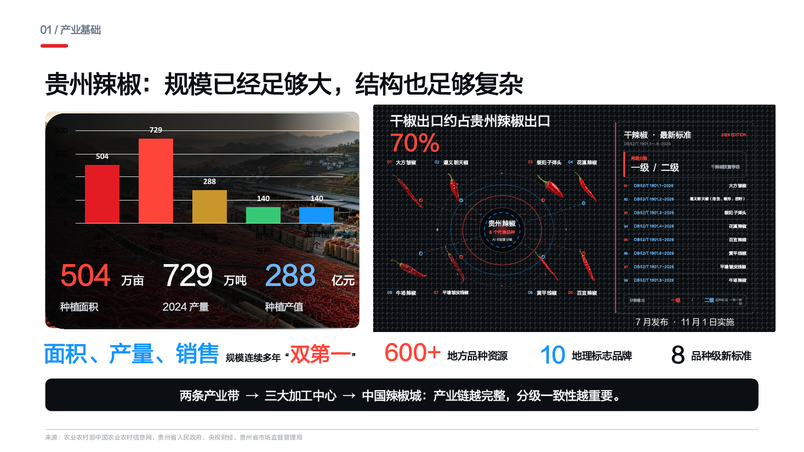
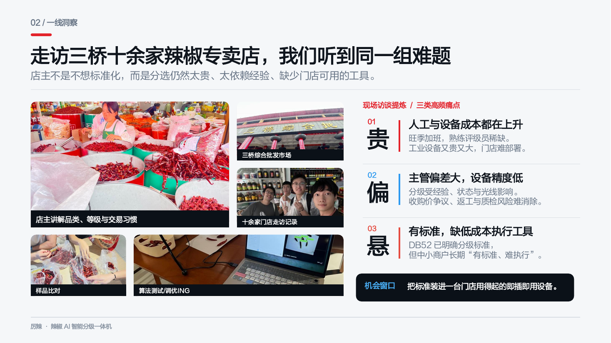
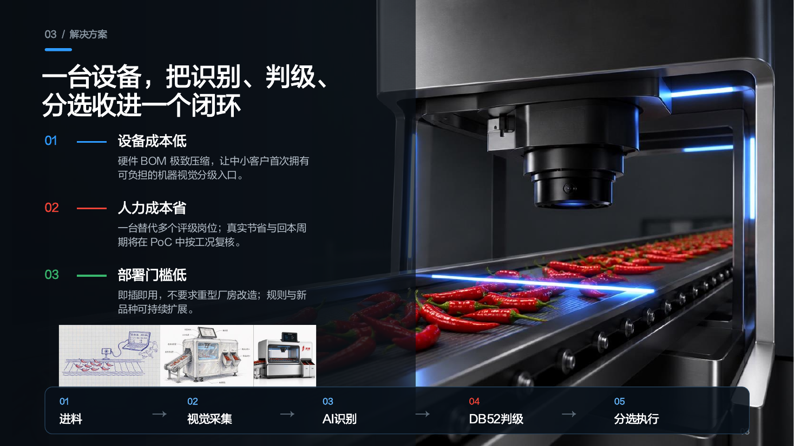
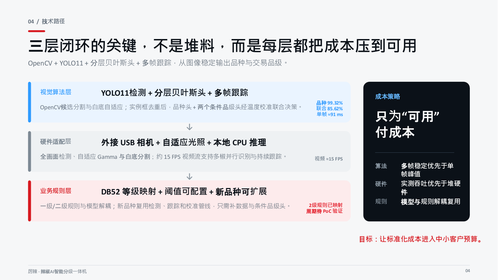
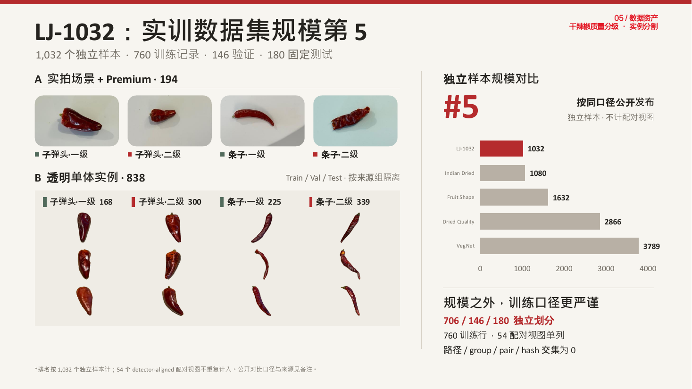
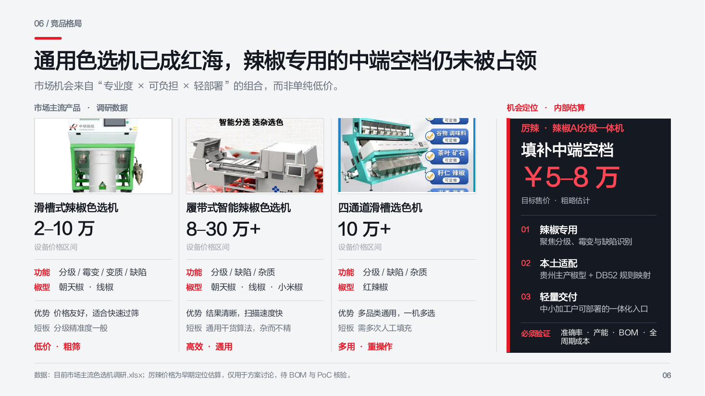
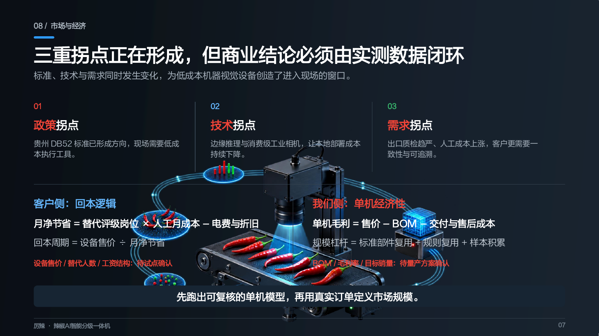
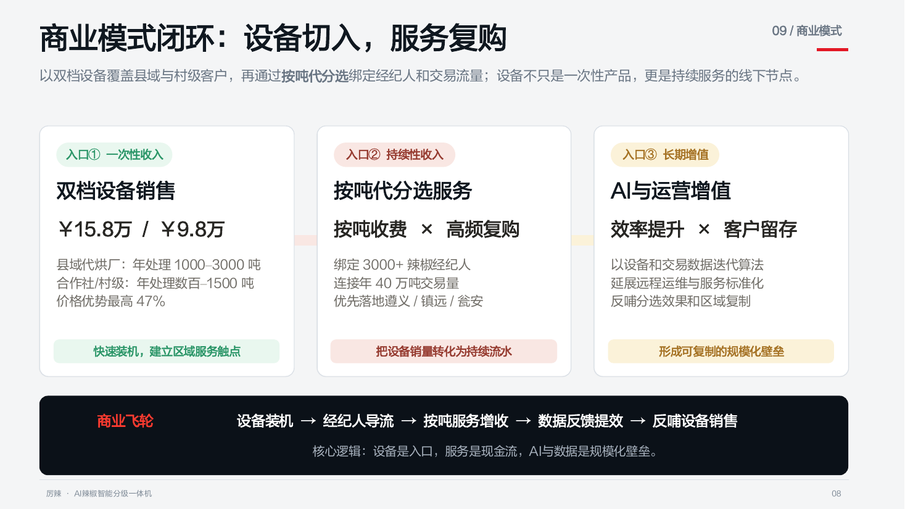
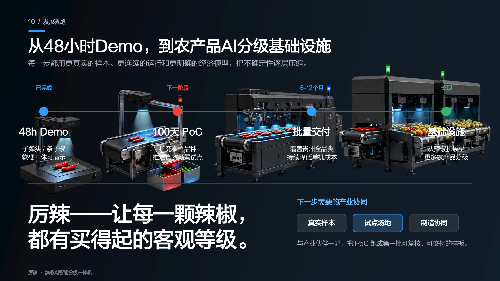

<div align="center">

# PepperSight | 厉辣·辣椒 AI 智能分级一体机

**把贵州辣椒分级标准，做成中小客户买得起的生产力。**

[](https://github.com/topics/guikesong)
[](https://www.python.org/)
[](https://fastapi.tiangolo.com/)
[](https://nextjs.org/)
[](https://docs.ultralytics.com/)
[](LICENSE)

[在线项目展示](https://jhengxu.github.io/PepperSight/) · [后端与前端说明](yolo11_pepper/qianjiao-ai-inspection/README.md) · [训练代码](yolo11_pepper)

</div>


## 项目简介

PepperSight 是第一届贵客松 **#Guikesong** 项目。项目面向贵州干辣椒的门店、合作社和中小型加工场景，将视觉检测、品种识别、质量分级、业务规则与可视化质检台整合为可本地运行的轻量系统。

当前演示链路为：

```text
外接 USB 相机
    ↓ OpenCV 采集、自适应光照与 ROI 触发
YOLO11 多辣椒定位
    ↓ 品种头 + 条件品级头 + 联合概率校准
DB52 等级映射与可配置评分规则
    ↓
FastAPI + SQLite + WebSocket
    ↓
Next.js 实时质检驾驶舱
```

## 已开源范围

本仓库公开可复用的工程代码，包括：

- 辣椒检测、单体提取与 DataLoader 脚本；
- 数据准备、特征提取、分层分类、半监督训练、评估与数据审计脚本；
- FastAPI 后端、SQLite 数据模型、WebSocket 广播、摄像头管线与集成测试；
- Next.js 前端、实时质检、批次分析、检测记录与评级规则页面。

为保护数据合规性并控制仓库体积，本仓库**不包含**原始/派生数据集、模型权重、实验输出、业务数据库、摄像头采集图片与团队个人信息。

## 技术栈与选型

### 视觉、训练与推理

- **Python 3.10+**：统一数据、训练、评估和后端推理链路。
- **OpenCV**：相机采集、帧差触发、候选分割、图像归一化与 MJPEG 编码。
- **Ultralytics YOLO11 + PyTorch**：多目标定位和多尺度特征骨干。
- **scikit-learn / XGBoost / joblib**：分层 SVM、梯度提升分类头、概率校准与模型封存。
- **NumPy / pandas / Pillow**：特征计算、样本清单、图像处理和审计报告。

### 后端与数据

- **FastAPI + Uvicorn + Pydantic**：异步 REST API、健康检查和数据校验。
- **SQLAlchemy + SQLite**：轻量本地持久化，适合单机 PoC 和现场演示。
- **WebSocket**：检测结果、批次统计与前端状态实时同步。
- **pytest + HTTPX**：评分引擎、摄像头管线、API 和数据流程测试。

### 前端

- **Next.js 14 + React 18 + TypeScript**：App Router 架构的实时质检应用。
- **Tailwind CSS**：可复用的设计标记与响应式布局。
- **Radix UI + Lucide React**：可访问的交互组件与图标。
- **Recharts**：批次等级分布、质量指标和趋势可视化。

## 目录结构

```text
PepperSight/
├── detect_peppers.py                 # 辣椒检测
├── extract_peppers.py                # 单体实例提取
├── pepper_dataloader.py              # 数据加载与校验
├── requirements-dataloader.txt
├── requirements-training.txt
├── yolo11_pepper/
│   ├── train_*.py / evaluate_*.py     # 训练与评估
│   ├── build_*.py / audit_*.py        # 数据准备与审计
│   └── qianjiao-ai-inspection/
│       ├── backend/                   # FastAPI 服务
│       └── frontend/                  # Next.js 应用
└── docs/                               # GitHub Pages 展示页与路演图集
```

## 快速开始

### 1. 启动后端

```bash
cd yolo11_pepper/qianjiao-ai-inspection/backend
python -m venv .venv
source .venv/bin/activate          # Windows: .venv\Scripts\activate
pip install -r requirements.txt
python -m uvicorn app.main:app --reload --port 8000
```

### 2. 启动前端

```bash
cd yolo11_pepper/qianjiao-ai-inspection/frontend
cp .env.local.example .env.local
npm install
npm run dev
```

访问：

- 实时质检台：`http://localhost:3000/inspection`
- API 文档：`http://localhost:8000/docs`
- 健康检查：`http://localhost:8000/api/health`

> 真实模型推理需要在本地配置检测器、分类器与外接摄像头。没有权重时，可使用项目自带 Mock 链路验证前后端和批次业务流。完整环境变量见[Web 子项目说明](yolo11_pepper/qianjiao-ai-inspection/README.md)。

## 验证

```bash
# 后端
cd yolo11_pepper/qianjiao-ai-inspection/backend
pytest -q

# 前端
cd ../frontend
npm run typecheck
npm run build
```

## 路演图集

以下图片来自贵客松路演材料，已排除团队成员介绍页。

<details>
<summary><strong>点击展开完整图集（10 页）</strong></summary>

### 产业基础



### 一线洞察



### 解决方案



### 技术路径



### 数据资产



### 竞品格局



### 市场与经济



### 商业模式



### 发展规划



</details>
率和 85.62% 四类联合准确率来自 clean v5 **物理隔离验证集**，不是独立盲测结果；当前仓库不将验证集指标表述为测试集成绩。设备价格、BOM、产能与回本周期均为早期假设，需通过实地 PoC 复核。

## 在线实例

- **已部署项目展示**：<https://jhengxu.github.io/PepperSight/>
- **完整实时实例**：需外接摄像头和本地模型权重，按上述快速开始步骤运行。

在线页面展示项目背景、方案、技术路径、数据口径、商业模式和发展规划；它不伪装为已连接工业摄像头的实时生产系统。

## 开源许可

本仓库公开的代码采用 [MIT License](LICENSE)。数据集、模型权重、商标与路演素材不因代码许可而自动获得同等授权。

